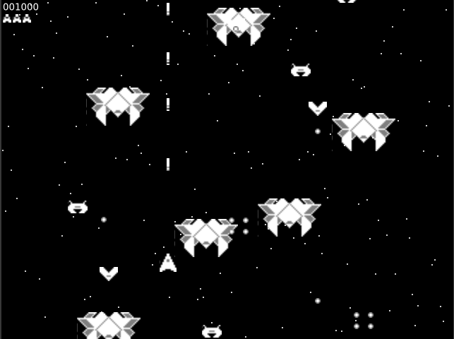

# Proof of Concept for a Gtk4 2D action game

This is a Proof of Concept showing that it is possible to make a simple 2D action game using only Gtk4 widgets which are now GPU rendered. The game from the [allegro vivace's 'gameplay' tutorial section](https://github.com/liballeg/allegro_wiki/wiki/Allegro-Vivace%3A-Gameplay) was used and modified just enough to make it run using only gtk4 widgets instead of allegro.

## How to play

* Arrow keys to move ship
* Space bar to shoot



## Issues

* __No sound fx__. I removed all codes related to sound effects as I am only testing the gtk4 widgets.

* __Keyboard input is not fluid__ as key press events are processed using the GtkEventControllerKey which is meant for widgets and not for game input processing.

* __No tint effects__ as implemented in the original allegro tutorial. May be can be implemented with gtk's CSS ?

## Implementation details

* The game loop is implemented using the tick callback.

* For game drawing, I preload GtkPictures inside a GtkFixed layout container then show or hide them as required and use gtk_fixed_move to reposition them.

* For animations like the explosions, I use the same GtkPicture but change its texture at different times with the function gtk_picture_set_paintable.

* I use a GtkOverlay to contain all the game's scene. You need to set the overlay's first child to a widget whose size corresponds to the screen size of your game. If not you will see the application window keeps resizing evertime that a GtkPicture is positioned at the border of the window. Also the advantage of using the GtkOverlay is that you can now create layers in your game like one for the background, one for the game's scene and one for the ui or something like that.

## Building

I have only tested the game on Linux using Fedora 34. Most probably it will also compile and run on Windows using MSYS2.

### Requirements

* A C compiler. I am using gcc.
* Gtk4 together with the dev packages installed. Tested with gtk4.2.1.

### Compiling

Just compile the game.c file and then run.

#### compile
```
gcc -o game game.c `pkg-config --cflags --libs gtk4`
```

#### run
```
./game
```
